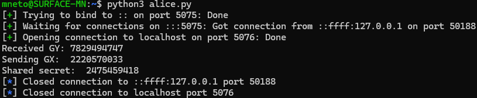
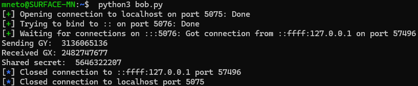
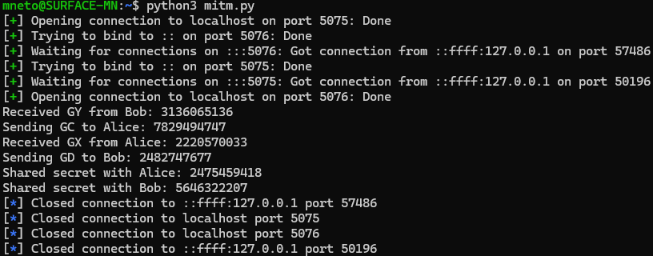

# Week #10 Extra

## Q1: *Man-in-the-Middle*

O ficheiro `mitm.py` implementa um protótipo que demonstra como um ataque *Man-in-the-Middle* pode ocorrer numa troca de chaves usando o protocolo Diffie-Hellman não autenticado, contendo o código para o adversário.
O código convence a Alice e o Bob a falarem com o adversário - em vez de falarem um com outro - e a realizarem uma troca de chaves com ele.

O fluxo de execução do código que realiza o ataque expõe-se abaixo.

O adversário:
1. Recebe $B = g^y$ do Bob;
2. Escolhe um expoente aleatório $c$;
3. Envia $C = g^c$ para a Alice;
4. Recebe $A = g^x$ da Alice;
5. Escolhe um expoente aleatório $d$;
6. Envia $D = g^d$ para o Bob;
7. Computa o segredo partilhado com a Alice: $A^c = (g^x)^c = g^{xc} = g^{cx} = (g^c)^x = C^x$;
8. Computa o segredo partilhado com o Bob: $B^d = (g^y)^d = g^{yd} = g^{dy} = (g^d)^y = D^y$.

Abaixo, apresenta-se um exemplo de execução.

A Alice concorda com o segredo $2475459418$.

O Bob concorda com o segredo $5646322207$.

Efetivamente, a Alice e o Bob não concordam no mesmo segredo, porque $2475459418 \neq 5646322207$.

O adversário conhece o segredo partilhado com a Alice ($2475459418$) e o segredo partilhado com o Bob ($5646322207$).

Portanto, ambos os segredos concordados são conhecidos pelo adversário.

Assim, como a Alice e o Bob não concordam no mesmo segredo e ambos os segredos concordados são conhecidos pelo adversário, realizou-se um ataque *Man-in-the-Middle* com sucesso.

## Q2: *ECC*

### P1

### P2

## Q3: *ElGamal*

### P1

### P2

### P3

