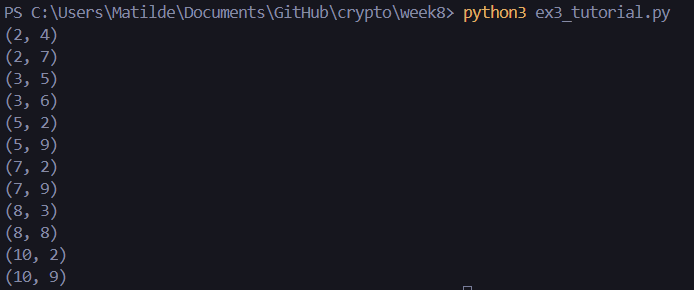
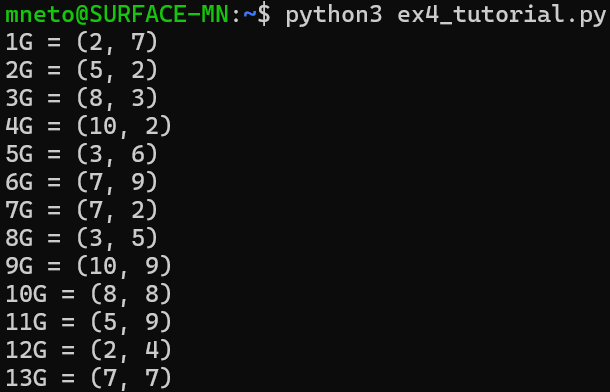

# Tutorial #10

## 1

- ponto $(4,7)$
- curva $y^2 = x^3 − 5x + 5$

### Em $\mathbb{Z}_{23}$:

Substituir $x = 4$ em $x^3 - 5x + 5 \pmod{23}$:

$$4^3 - 5 \times 4 + 5 \equiv 3 \pmod{23}$$

Calcular $y^2 \pmod{23}$ para $y = 7$:

$$7^2 \equiv 3 \pmod{23}$$

Como $y^2 \equiv x^3 - 5x + 5 \pmod{23}$ para $x = 4$ e $y = 7$, o ponto $(4,7)$ pertence à curva $y^2 = x^3 − 5x + 5$ em $\mathbb{Z}_{23}$.

### Em $\mathbb{R}$:

Substituir $x = 4$ em $x^3 - 5x + 5$:

$$4^3 - 5 \times 4 + 5 = 49$$

Calcular $y^2$ para $y = 7$:

$$7^2 = 49$$

Como $y^2 = x^3 - 5x + 5$ para $x = 4$ e $y = 7$, o ponto $(4,7)$ pertence à curva $y^2 = x^3 − 5x + 5$ em $\mathbb{R}$.

Logo, o ponto $(4,7)$ pertence à curva $y^2 = x^3 - 5x + 5$ em $\mathbb{Z}_{23}$ e em $\mathbb{R}$.

## 2

- ponto $P = (-2, 2)$
- ponto $Q = (3, 3)$
- curva $y^2 = x^3 − 6x$

### Calcular $P + Q$

Calcular o declive: $m = \frac{3 - 2}{3 - (-2)}$ = $\frac{1}{5}$

$$x_R = \left(\frac{1}{5}\right)^2 - (-2) - 3 = \frac{1}{25} + 2 - 3 = -\frac{24}{25}$$

$$y_R = \frac{1}{5}\left(-2 - \left(-\frac{24}{25}\right)\right) - 2 = -\frac{276}{125}$$

Portanto, $R = P + Q = \left(-\frac{24}{25}, -\frac{276}{125}\right)$.

### Calcular $2P$

Calcular p declive: $m = \frac{3(-2)^2 - 6}{2 \times 2} = \frac{12}{4} = 3$

$$x_R = 3^2 + 2 + 2 = 13$$

$$y_R = 3 \times (- 2 - 13) - 2 = -47$$

Portanto, $R = 2P = (13, -47)$.

## 3

Pretende-se determinar todos os pontos da curva elíptica definida por $y^2 = x^3 + x + 6$ em $\mathbb{Z}_{11}$.

O código está implementado no ficheiro `ex3_tutorial.py` e a imagem abaixo mostra a execução do código.

## 4

Pretende-se computar os múltiplos de $G = (2, 7)$ desde $2G$ até $13G$ na curva elíptica definida por $y^2 = x^3 + x + 6$ em $\mathbb{Z}_{11}$.

O código está implementado no ficheiro `ex4_tutorial.py` e a imagem abaixo mostra a execução do código.

## 5

O código para as 3 alíneas está implementado no ficheiro `ex5_tutorial.py`.

Cada alínea está identificada com um comentário no código, sendo as funções relevantes as seguintes:
- `generate_keys()`, para a alínea (a);
- `sign_message(private_key_hex, message)`, para a alínea (b);
- `verify_signature(public_key_hex, message, signature_hex)`, para a alínea (c).

A imagem abaixo mostra a execução do código.

