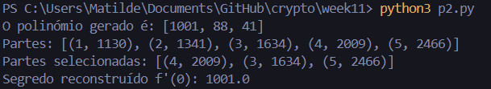
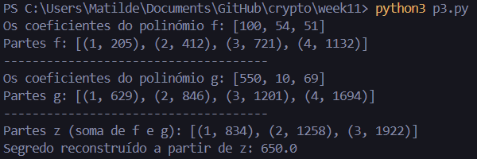

# Week #11 Extra

## Q1: Demonstrating forgeability of plain RSA

Primeiramente, vai-se gerar um par de chaves *(sk, pk)* e um valor *b*.

O adversário recebe *pk* e o valor *b* e escolhe duas mensagens **m0** e **m1b**, tendo em conta que **m0m1** $\equiv$ 1 mod n. Pede, então, as assinaturas de **m0** e **m1b**.

De seguida, o adversário recebe sign(**m0**) = **m0sk** mod n e sign(**m1b**) = (**m1b)sk** mod n. 

Com isto, o adversário vai conseguir uma assinatura (*s*) válida para *b* com probabilidade igual a 1, porque *s* = **m0sk** * **m1sk** mod n = **(m0m1b)sk** mod n = **bsk** mod n.

A vulnerabilidade existe devido à linearidade multiplicativa da assinatura, que permite que o adversário combine assinaturas conhecidas para gerar assinaturas de mensagens não solicitadas. 

## Q2: Shamir Secret Sharing

### P1

O código para implementar a **secret sharing function** detalhada no enunciado está no ficheiro **p1.py**. Abaixo está um exemplo de execução do código.

#### 1

Para reconstruir o segredo usando três partes, o polinómio deve ter grau 2 para garantir que existe apenas um polinómio que passa por três pontos.

Assim é garantido que três partes são necessárias para reconstruir o segredo e que duas partes não são suficientes para reconstruir o segredo, pois podem passar infinitos polinómios de grau 2 pelas duas partes fornecidas se não houver uma terceira parte.

#### 2

Para gerar um polinómio **f(x)** de grau 2 tal que **f(0) = x** devemos seguir os seguintes passos:

1. Representar o segredo **x** como o termo constante **a_0**;
2. Escolher dois coeficientes aleatórios **a_1** e **a_2**;
3. Construir o polinómio do tipo **f(x) = a_0 + a_1x + a_2x2**.

Depois, deve-se calcular **f(x_1)**, **f(x_2)**, **f(x_3)** e **f(x_4), onde **x_1**, **x_2**, **x_3** e **x_4** são pontos distintos e não nulos.

Cria-se, então, as partes **(x_1, f(x_1))**, **(x_2, f(x_2))**, **(x_3, f(x_3))** e **(x_4, f(x_4))**.

### P2

O código implementado para este exercício encontra-se no ficheiro **p2.py**. Para construir o polinómio **f'(x)** usei o método **Lagrange Interpolation**.

Abaixo está um exemplo de execução do código.

### P3

O código implementado para este exercício encontra-se no ficheiro **p3.py**. Cada ponto pedido no enunciado está identifcado com um comentário no código.

Abaixo está um exemplo de execução do código.

Como podemos observar, o segredo obtido ao utilizar os pontos **z1, z2, z3** é a soma dos segredos originais **100 + 550**, ou seja, **650**, como podemos verificar na imagem. 

Isto ocorre devido à **propriedade de linearidade da interpolação de Lagrange**. Quando geramos os pontos **zi** como a soma das partes **xi** e **yi** provenientes dos polinómios **f(x)** e **g(x)**, estamos essencialmente a criar um novo polinómio **z(x) = f(x) + g(x)**. Este polinómio resultante **z(x)** preserva as propriedades dos polinómios **f(x)** e **g(x)**, incluindo o valor no ponto **x = 0**.

Durante a reconstrução do segredo a partir de **z1, z2, z3**, a interpolação de Lagrange reconstitui o polinómio **z(x)**. Assim, temos **z(0) = f(0) + g(0)**, onde **f(0)** e **g(0)** são os segredos originais, **100** e **550**, respetivamente.

Essa propriedade demonstra que, ao fazer operações matemáticas sobre os pontos dos polinómios, as operações realizadas nos segredos originais são refletidas no polinómio resultante **z(x)**. Portanto, o segredo obtido, **650**, é a soma direta dos dois segredos originais, e isso ocorre devido à estrutura matemática do **shamir secret sharing**.
