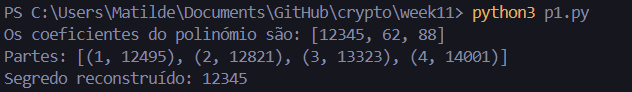

# Week #11 Extra

## Q1: *Demonstrating forgeability of plain RSA*

Primeiramente, gera-se um par de chaves $(sk, pk)$ e um valor $b$.

O adversário recebe $pk$ e o valor $b$ e escolhe duas mensagens $m_0$ e $m_1b$, tendo em conta que $m_0m_1 \equiv 1 \pmod{n}$.
Pede, então, as assinaturas de $m_0$ e $m_1b$.

De seguida, o adversário recebe $sign(m_0) = m_0^{sk} \mod n$ e $sign(m_1b) = (m_1b)^{sk} \mod n$. 

Com isto, o adversário vai conseguir uma assinatura ($s$) válida para $b$ com probabilidade igual a 1, porque $s \equiv m_0^{sk} \times (m_1b)^{sk} \equiv (m_0m_1b)^{sk} \equiv b^{sk} \pmod{n}$, porque $m_0m_1 \equiv 1 \pmod{n}$.

A vulnerabilidade existe devido à linearidade multiplicativa da assinatura, que permite que o adversário combine assinaturas conhecidas para gerar assinaturas de mensagens não solicitadas.

## Q2: *Shamir Secret Sharing*

### P1

O código para implementar a ***secret sharing function*** detalhada no enunciado está no ficheiro `p1.py`.

Abaixo está um exemplo de execução do código.

#### 1

Para reconstruir o segredo usando três partes, o polinómio deve ter grau 2 para garantir que existe apenas um polinómio que passa por três pontos.

Assim é garantido que três partes são necessárias e suficientes para reconstruir o segredo e que duas partes não são suficientes para reconstruir o segredo, pois podem passar infinitos polinómios de grau 2 pelas duas partes fornecidas se não houver uma terceira parte.

#### 2

Para gerar um polinómio $f(x)$ de grau 2 tal que $f(0) = x$, devem ser seguidos os seguintes passos:

1. Representar o segredo $x$ como o termo constante $a_0$;
2. Escolher dois coeficientes aleatórios $a_1$ e $a_2$;
3. Construir o polinómio do tipo $f(x) = a_0 + a_1x + a_2x^2$.

Depois, deve calcular-se $f(x_1)$, $f(x_2)$, $f(x_3)$ e $f(x_4)$, em que $x_1$, $x_2$, $x_3$ e $x_4$ são pontos distintos e não nulos.

Criam-se, então, as partes $(x_1, f(x_1))$, $(x_2, f(x_2))$, $(x_3, f(x_3))$ e $(x_4, f(x_4))$.

### P2

O código implementado para este exercício encontra-se no ficheiro `p2.py`.
Para construir o polinómio $f'(x)$, usou-se o método ***Lagrange Interpolation***.

Abaixo está um exemplo de execução do código.

### P3

O código implementado para este exercício encontra-se no ficheiro `p3.py`.
Cada tópico pedido no enunciado está identificado com um comentário no código.

Abaixo está um exemplo de execução do código.

Como é possível verificar na imagem, o segredo obtido ao utilizar os pontos $z_1, z_2, z_3$ é a soma dos segredos originais $100 + 550$, ou seja, $650$. 

Isto ocorre devido à **propriedade de linearidade da interpolação de Lagrange**.
Quando se geram os pontos $z_i$ como a soma das partes $x_i$ e $y_i$ provenientes dos polinómios $f(x)$ e $g(x)$, respetivamente, está essencialmente a criar-se um novo polinómio $z(x) = f(x) + g(x)$.
Este polinómio resultante $z(x)$ preserva as propriedades dos polinómios $f(x)$ e $g(x)$, incluindo o valor no ponto $x = 0$.

Durante a reconstrução do segredo a partir de $z_1, z_2, z_3$, a interpolação de Lagrange reconstitui o polinómio $z(x)$.
Assim, tem-se $z(0) = f(0) + g(0)$, em que $f(0)$ e $g(0)$ são os segredos originais, $100$ e $550$, respetivamente.

Esta propriedade demonstra que, ao fazer operações matemáticas sobre os pontos dos polinómios, as operações realizadas nos segredos originais são refletidas no polinómio resultante $z(x)$.
Portanto, o segredo obtido, $650$, é a soma direta dos dois segredos originais e isto ocorre devido à estrutura matemática do ***Shamir Secret Sharing***.
