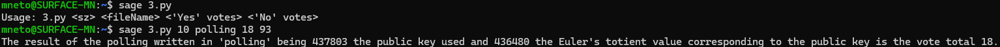

# Tutorial #11

## 1

### a

O procedimento aceite de um cliente que recebe um certificado de chave pública proveniente de um servidor *web* é o seguinte.

O cliente deve:
1. Verificar se a identidade do servidor está correta, por exemplo através do nome DNS para o servidor;
2. Verificar se o tempo atual está abrangido no período de validade do certificado e se o certificado não foi revogado;
3. Verificar se a meta-informação presente no certificado faz sentido para a aplicação;
4. Verificar se a Autoridade Certificadora é confiável - de forma implícita ou por cadeia/hierarquia - para certificar a chave pública do certificado do servidor;
5. Obter a chave pública da Autoridade Certificadora e verificar se a assinatura no certificado está correta.

### b

O processo de revogação de certificados é utilizado para invalidar certificados que ainda estão dentro do prazo de validade, isto é, que ainda parecem válidos. 

Este processo utiliza Listas de Revogação de Certificados, publicadas pela Autoridade Certificadora, que são *black-lists* de certificados revogados, publicadas periodicamente ou em casos excecionais.
Os clientes, para validar um certificado, devem verificar a sua ausência na Lista de Revogação de Certificados mais recente.

Na realidade, existem três soluções possíveis para a revogação de certificados:
1. ***Trusted Service Provider Lists* (TSL):** manter uma *white-list* com os certificados confiáveis - apenas utilizado em grupos pequenos e em aplicações de alta segurança;
2. ***On-line Certificate Status Protocol* (OCSP):** um servidor confiável, normalmente gerido pela própria Autoridade Certificadora, verifica as Listas de Revogação de Certificados - utilizado em grandes contextos organizacionais;
3. ***Certificate Pinning*:** os próprios servidores, *browsers* e aplicações têm as suas próprias *white-lists*, que identificam bons certificados para entidades importantes.

Algumas razões possíveis para aplicar o processo de revogação de certificados podem ser o comprometimento da chave privada associada ao certificado, o uso indevido do certificado, os dados do certificado tornarem-se inválidos, ou existir - por alguma outra eventual razão - uma quebra da relação de confiança entre o titular do certificado e a Autoridade Certificadora.

## 2

No esquema de Paillier, considerem os seguintes dados:
- $n = 620496404349687915307910174617$
- $c = 358624662650643040547102063483144791182626860568435345308004$

Para recuperar a mensagem original, o processo é o seguinte:

$$n = 620496404349687915307910174617$$
$$n = 772886493240161 \times 802829923639097$$
$$\space$$
$$\phi({n}) = \phi({620496404349687915307910174617})$$
$$\phi({n}) = (772886493240161 - 1) \times (802829923639097 - 1)$$
$$\phi({n}) = 620496404349686339591493295360$$
$$\space$$
$$c = 358624662650643040547102063483144791182626860568435345308004$$
$$\space$$
$$\hat{c} = c^{\phi({n})} \mod n^2$$
$$\hat{c} = 358624662650643040547102063483144791182626860568435345308004^{620496404349686339591493295360} \mod 620496404349687915307910174617^2$$
$$\hat{c} = 385015787365373761792988167834554934384120851880533355749167$$
$$\space$$
$$\hat{m} = (\hat{c} - 1)/n$$
$$\hat{m} = (385015787365373761792988167834554934384120851880533355749167 - 1)/620496404349687915307910174617$$
$$\hat{m} = 620496403631685942777789775198$$
$$\space$$
$$\phi({n})^{-1} \mod n = 620496404349686339591493295360^{-1} \mod 620496404349687915307910174617 = 406384760959582831173471620283$$
$$\space$$
$$m = \hat{m} \times \phi({n})^{-1} \mod n$$
$$m = 620496403631685942777789775198 \times 406384760959582831173471620283 \mod 620496404349687915307910174617$$
$$m = 455667$$

Assim, a mensagem original correspondente ao criptograma intersetado é $m = 455667$.

## 3

O ficheiro `3.py` contém os 4 procedimentos relevantes para a realização de uma votação usando o esquema de encriptação de Paillier, nomeadamente:
- `genPrivate(sz)` para fazer *output* de um triplo $(n, p, q)$ nas condições de $n$ ser usado como a chave pública de um esquema de Paillier e $n = pq$, sendo $p$ e $q$ números primos de tamanho $sz$ *bits*;
- `vote(fileName, n, v)` para acrescentar ao ficheiro `fileName` um voto `v` usando o esquema de Paillier e a chave pública `n`;
- `voteYes(fileName, n)` para acrescentar ao ficheiro `fileName` um voto *yes* ($=1$) usando o esquema de Paillier e a chave pública `n`;
- `voteNo(fileName, n)` para acrescentar ao ficheiro `fileName` um voto *no* ($=0$) usando o esquema de Paillier e a chave pública `n`;
- `getResults(fileName, n, phi)` para imprimir o resultado da votação escrita em `fileName`, sendo `n` a chave pública usada e `phi` o valor tociente de Euler correspondente à chave pública.

Abaixo, apresenta-se um exemplo de execução.

