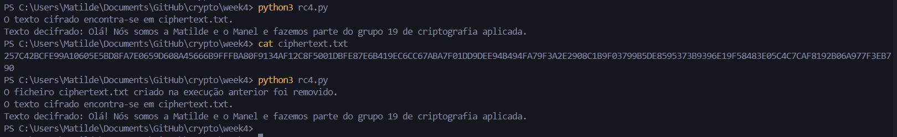

# Tutorial #4

Polinómio 1: x<sup>3</sup> + x + 1

Polinómio 2: x<sup>4</sup> + x + 1

Polinómio 3: x<sup>4</sup> + x<sup>3</sup> + x<sup>2</sup> + 1

### 1.1

#### Para o polinómio 1

R0: 010

```
f(R0) = S3 + S1 = 0 + 0 
Output = 0
R1 = 100

f(R1) = S3 + S1 = 1 + 0
Output = 1
R2 = 001

f(R2) = S3 + S1 = 0 + 1
Output = 1
R3 = 011

f(R3) = S3 + S1 = 0 + 1
Output = 1
R4 = 111

f(R4) = S3 + S1 = 1 + 1
Output = 0
R5 = 110

f(R5) = S3 + S1 = 1 + 0
Output = 1
R6 = 101

f(R6) = S3 + S1 = 1 + 1
Output = 0
R7 = 010
```

O período do LFSR iniciado com R0 = 010 é 7, o que significa que a sequência gerada se repete após 7 shifts. Como o polinómio tem grau 3, o período máximo possível é 2<sup>3</sup> - 1 = 7.

Dado que o LFSR alcança este período máximo, podemos concluir que o polinómio x<sup>3</sup> + x + 1 é primitivo, ou seja, gera a sequência máxima para o seu grau.

#### Para o polinómio 2

R0: 0100

```
f(R0) = S4 + S1 = 0 + 0
Output = 0
R1 = 1000

f(R1) = S4 + S1 = 1 + 0
Output = 1
R2 = 0001

f(R2) = S4 + S1 = 0 + 1
Output = 1
R3 = 0011

f(R3) = S4 + S1 = 0 + 1
Output = 1
R4 = 0111

f(R4) = S4 + S1 = 0 + 1
Output = 1
R5 = 1111

f(R5) = S4 + S1 = 1 + 1
Output = 0
R6 = 1110

f(R6) = S4 + S1 = 1 + 0
Output = 1
R7 = 1101

f(R7) = S4 + S1 = 1 + 1
Output = 0
R8 = 1010

f(R8) = S4 + S1 = 1 + 0 
Output = 1
R9 = 0101

f(R9) = S4 + S1 = 0 + 1
Output = 1
R10 = 1011

f(R10) = S4 + S1 = 1 + 1
Output = 0
R11 = 0110

f(R11) = S4 + S1 = 0 + 0
Output = 0
R12 = 1100

f(R12) = S4 + S1 = 1 + 0
Output = 1
R13 = 1001

f(R13) = S4 + S1 = 1 + 1
Output = 0
R14 = 0010

f(R14) = S4 + S1 = 0 + 0
Output = 0
R15 = 0100
```

O período do LFSR iniciado com R0 = 0100 é 15, o que significa que a sequência gerada se repete após 15 shifts. Como o polinómio tem grau 4, o período máximo possível é 2<sup>4</sup> - 1 = 15.

Dado que o LFSR alcança este período máximo, podemos concluir que o polinómio x<sup>4</sup> + x + 1 é primitivo, ou seja, gera a sequência máxima para o seu grau.

#### Para o polinómio 3

R0: 0110

```
f(R0) = S4 + S3 + S2 = 0 + 1 + 1
Output = 0
R1 = 1100

f(R1) = S4 + S3 + S2 = 1 + 1 + 0
Output = 0
R2 = 1000

f(R2) = S4 + S3 + S2 = 1 + 0 + 0
Output = 1
R3 = 0001

f(R3) = S4 + S3 + S2 = 0 + 0 + 0
Output = 0
R4 = 0010

f(R4) = S4 + S3 + S2 = 0 + 0 + 1
Output = 1
R5 = 0101

f(R5) = S4 + S3 + S2 = 0 + 1 + 0
Output = 1
R6 = 1011

f(R6) = S4 + S3 + S2 = 1 + 0 + 1
Output = 0
R7 = 0110
```

O período do LFSR iniciado com R0 = 0110 é 7, o que significa que a sequência gerada se repete após 7 shifts. Como o polinómio tem grau 4, o período máximo possível é 2<sup>4</sup> - 1 = 15.

Dado que o LFSR não alcança o período máximo, podemos concluir que o polinómio x<sup>4</sup> + x<sup>3</sup> + x<sup>2</sup> + 1 não é primitivo, ou seja, não gera a sequência máxima para o seu grau.

### 1.2

O polinómio ideal para um LFSR deve ser **primitivo**, o que significa que deve gerar o período máximo possível para o seu grau, garantindo que o LFSR passe por todos os estados não nulos antes de repetir a sequência. Tanto o polinómio x<sup>3</sup> + x + 1 quanto o polinómio x<sup>4</sup> + x + 1 são primitivos, o que significa que ambos atingem o período máximo para os seus respetivos graus (7 para o grau 3 e 15 para o grau 4).

No entanto, o polinómio x<sup>3</sup> + x + 1 pode ser considerado o **melhor polinómio** para um LFSR nalguns casos.

O grau de um polinómio influencia diretamente a complexidade da implementação do LFSR, especialmente em hardware. Como o polinómio x<sup>3</sup> + x + 1 tem um menor grau (3), exige menos registos e menos operações lógicas para calcular cada sequência do LFSR. Isso significa que consome menos recursos de hardware e é mais eficiente em termos de velocidade de execução.

Embora o polinómio x<sup>4</sup> + x + 1 ofereça um período maior (15), o período de 7 gerado pelo polinómio x<sup>3</sup> + x + 1 é mais do que suficiente para muitas aplicações, como geração de padrões pseudoaleatórios, testes de hardware e até certas aplicações criptográficas de menor escala. Para muitas dessas aplicações, o período de 7 oferece um bom equilíbrio entre o tamanho da sequência e a eficiência da implementação.

Assim, embora ambos os polinómios sejam primitivos e garantam o período máximo, o polinómio x<sup>3</sup> + x + 1 é frequentemente a **melhor escolha** devido à sua simplicidade, resultando numa implementação mais eficiente em termos de hardware e consumo de recursos. No entanto, a escolha do polinómio ideal depende das necessidades específicas da aplicação, como requisitos de período, complexidade, velocidade e consumo das operação.

### 1.3

```python
F.<x> = GF(2)[]

p1 = x^3 + x + 1
p2 = x^4 + x + 1
p3 = x^4 + x^3 + x^2 + 1

print("p1 é irreducível:", p1.is_irreducible())
print("p2 é irreducível:", p2.is_irreducible())
print("p3 é irreducível:", p3.is_irreducible())
```

p1 é irreducível: True
p2 é irreducível: True
p3 é irreducível: False

No contexto dos LFSRs, a irreducibilidade é uma condição necessária (mas não suficiente) para o polinómio ser primitivo. Isso significa que polinómios irreducíveis têm maior probabilidade de produzir uma sequência longa e não repetitiva, uma vez que não podem ser decompostos em ciclos menores.

Se um polinómio não for irreducível, ele pode ser decomposto em polinómios menores. Para LFSRs, isso significa que a sequência gerada não terá o período máximo e pode repetir-se prematuramente ou gerar ciclos mais curtos. Por exemplo, x<sup>4</sup> + x<sup>3</sup> + x<sup>2</sup> + 1 não é irreducível, o que significa que não produzirá uma sequência de período máximo, como já foi provado anteriormente.

### 2

O código que utilizamos foi retirado deste link **https://github.com/manojpandey/rc4/blob/master/rc4-3.py** e foi modificado para aceitar um ficheiro de texto como input e para criar um ficheiro de texto como output **ciphertext.txt**. Também retira o ficheiro de texto cifrado da execução anterior, retornando no terminal o texto original para verificar que a encriptação e desencriptação foram bem sucedidas.

O código final encontra-se no ficheiro **rc4.py** e deve ser testado com o ficheiro **plaintext.txt**.

Abaixo, podemos observar um exemplo de utilização.



### 3