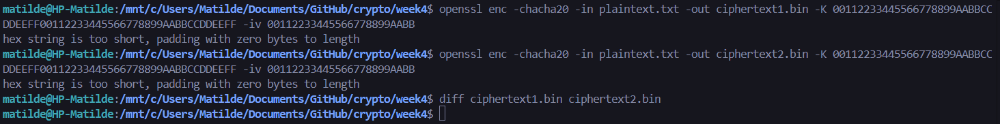

# Tutorial #4

Polinómio 1: x<sup>3</sup> + x + 1

Polinómio 2: x<sup>4</sup> + x + 1

Polinómio 3: x<sup>4</sup> + x<sup>3</sup> + x<sup>2</sup> + 1

### 1.1

#### Para o polinómio 1

R0: 010

```
f(R0) = S3 + S1 = 0 + 0 = 0
Output = 0
R1 = 100

f(R1) = S3 + S1 = 1 + 0 = 1
Output = 1
R2 = 001

f(R2) = S3 + S1 = 0 + 1 = 1
Output = 0
R3 = 011

f(R3) = S3 + S1 = 0 + 1 = 1
Output = 0
R4 = 111

f(R4) = S3 + S1 = 1 + 1 = 0
Output = 1
R5 = 110

f(R5) = S3 + S1 = 1 + 0 = 1
Output = 1
R6 = 101

f(R6) = S3 + S1 = 1 + 1 = 0
Output = 1
R7 = 010
```

O LFSR iniciado com *R0 = 010* apresenta um período de 7, o que significa que a sequência gerada se repete após 7 *shifts*. Este valor coincide com o período máximo possível para um LFSR de 3 bits, que é *2<sup>3</sup> - 1 = 7*.

Como o LFSR atinge esse período máximo, podemos concluir com elevada confiança que o polinómio *x<sup>3</sup> + x + 1* é primitivo. Isto implica que gera a sequência máxima possível para *n = 3*, independentemente do valor inicial no ciclo. Ou seja, qualquer valor de partida que pertença ao ciclo levará inevitavelmente à mesma sequência periódica, demonstrando que o polinómio gera todas as combinações possíveis de estados antes de se repetir.

#### Para o polinómio 2

R0: 0100

```
f(R0) = S4 + S1 = 0 + 0 = 0
Output = 0
R1 = 1000

f(R1) = S4 + S1 = 1 + 0 = 1
Output = 1
R2 = 0001

f(R2) = S4 + S1 = 0 + 1 = 1
Output = 0
R3 = 0011

f(R3) = S4 + S1 = 0 + 1 = 1
Output = 0
R4 = 0111

f(R4) = S4 + S1 = 0 + 1 = 1
Output = 0
R5 = 1111

f(R5) = S4 + S1 = 1 + 1 = 0
Output = 1
R6 = 1110

f(R6) = S4 + S1 = 1 + 0 = 1
Output = 1
R7 = 1101

f(R7) = S4 + S1 = 1 + 1 = 0
Output = 1
R8 = 1010

f(R8) = S4 + S1 = 1 + 0 = 1
Output = 1
R9 = 0101

f(R9) = S4 + S1 = 0 + 1 = 1
Output = 0
R10 = 1011

f(R10) = S4 + S1 = 1 + 1 = 0
Output = 1
R11 = 0110

f(R11) = S4 + S1 = 0 + 0 = 0
Output = 0
R12 = 1100

f(R12) = S4 + S1 = 1 + 0 = 1
Output = 1
R13 = 1001

f(R13) = S4 + S1 = 1 + 1 = 0
Output = 1
R14 = 0010

f(R14) = S4 + S1 = 0 + 0 = 0
Output = 0
R15 = 0100
```

O LFSR iniciado com *R0 = 0100* apresenta um período de 15, o que significa que a sequência gerada se repete após 15 *shifts*. Este valor coincide com o período máximo possível para um LFSR de 4 bits, que é *2<sup>4</sup> - 1 = 15*.

Como o LFSR atinge esse período máximo, podemos concluir com elevada confiança que o polinómio *x<sup>4</sup> + x + 1* é primitivo. Isto implica que gera a sequência máxima possível para *n = 4*, independentemente do valor inicial no ciclo. Ou seja, qualquer valor de partida que pertença ao ciclo levará inevitavelmente à mesma sequência periódica, demonstrando que o polinómio gera todas as combinações possíveis de estados antes de se repetir.

#### Para o polinómio 3

R0: 0110

```
f(R0) = S4 + S3 + S2 = 0 + 1 + 1 = 0
Output = 0
R1 = 1100

f(R1) = S4 + S3 + S2 = 1 + 1 + 0 = 0
Output = 1
R2 = 1000

f(R2) = S4 + S3 + S2 = 1 + 0 + 0 = 1
Output = 1
R3 = 0001

f(R3) = S4 + S3 + S2 = 0 + 0 + 0 = 0
Output = 0
R4 = 0010

f(R4) = S4 + S3 + S2 = 0 + 0 + 1 = 1
Output = 0
R5 = 0101

f(R5) = S4 + S3 + S2 = 0 + 1 + 0 = 1
Output = 0
R6 = 1011

f(R6) = S4 + S3 + S2 = 1 + 0 + 1 = 0
Output = 1
R7 = 0110
```

O LFSR iniciado com *R0 = 0110* apresenta um período de 7, o que significa que a sequência gerada se repete após 7 *shifts*. Este valor não coincide com o período máximo possível para um LFSR de 4 bits, que é *2<sup>4</sup> - 1 = 15*.

Como o LFSR não atinge o período máximo, podemos concluir que o polinómio *x<sup>4</sup> + x<sup>3</sup> + x<sup>2</sup> + 1* não é primitivo. Isto implica que a sequência gerada não é a máxima possível para *n = 4*, o que significa que o polinómio não gera todas as combinações possíveis de estados antes de se repetir.

### 1.2

O polinómio ideal para um LFSR deve ser **primitivo**, o que significa que deve gerar o período máximo possível, garantindo que o LFSR passe por todos os estados não nulos antes de repetir a sequência. Tanto o polinómio x<sup>3</sup> + x + 1 quanto o polinómio x<sup>4</sup> + x + 1 são, com grande confiança, primitivos, o que significa que ambos atingem o período máximo para os seus respetivos graus (7 para o grau 3 e 15 para o grau 4).

No entanto, o polinómio x<sup>4</sup> + x + 1 pode ser considerado o **melhor polinómio** para um LFSR.
Isto porque os LFSR com maior período tendem a ser mais seguros.

Embora o polinómio x<sup>3</sup> + x + 1 ofereça um período menor (7), para alguns casos, consegue ser suficiente para muitas aplicações de menor escala, pois o período de 7 oferece um bom equilíbrio entre o tamanho da sequência e a eficiência da implementação, exigindo menos registos e menos operações lógicas para calcular cada sequência do LFSR. 

Assim, embora ambos os polinómios sejam primitivos e garantam o período máximo, o polinómio x<sup>4</sup> + x + 1 é frequentemente a **melhor escolha** devido ao seu maior período e à maior segurança que oferece.

### 1.3

```python
F.<x> = GF(2)[]

p1 = x^3 + x + 1
p2 = x^4 + x + 1
p3 = x^4 + x^3 + x^2 + 1

print("p1 é irredutível:", p1.is_irreducible())
print("p2 é irredutível:", p2.is_irreducible())
print("p3 é irredutível:", p3.is_irreducible())
```

p1 é irredutível: True

p2 é irredutível: True

p3 é irredutível: False

No contexto dos LFSRs, a irredutibilidade é uma condição necessária (mas não suficiente) para o polinómio ser primitivo. Isso significa que polinómios irredutíveis têm maior probabilidade de produzir uma sequência longa e não repetitiva, uma vez que não podem ser decompostos em ciclos menores.

Se um polinómio não for irredutível, ele pode ser decomposto em polinómios menores. Para LFSRs, isso significa que a sequência gerada não terá o período máximo e pode repetir-se prematuramente ou gerar ciclos mais curtos. Por exemplo, x<sup>4</sup> + x<sup>3</sup> + x<sup>2</sup> + 1 não é irredutível, o que significa que não produzirá uma sequência de período máximo, como já foi provado anteriormente.

### 2

O código que utilizamos foi retirado deste link **https://github.com/manojpandey/rc4/blob/master/rc4-3.py** e foi modificado para aceitar um ficheiro de texto como input e para criar um ficheiro de texto como output **ciphertext.txt**. Também retira o ficheiro de texto cifrado da execução anterior, retornando no terminal o texto original para verificar que a encriptação e a desencriptação foram bem sucedidas.

O código final encontra-se no ficheiro **rc4.py** e deve ser testado com o ficheiro **plaintext.txt**.

Abaixo, podemos observar um exemplo de utilização.


### 3

O algoritmo RC4 do exercício anterior não é diretamente compatível com a implementação do OpenSSL sem algumas adaptações. OpenSSL suporta RC4, mas utiliza o seu próprio formato de entrada e saída para encriptar e desencriptar.

Aqui estão alguns pontos a considerar quando se trata da compatibilidade com o OpenSSL:

O exercício anterior implementa uma encriptação para um ficheiro hexadecimal e pega nesse mesmo ficheiro para o desencriptar. O OpenSSL encripta texto para ficheiros binários e desencripta ficheiros binários para texto. A gestão da chave também é diferente, uma vez que o OpenSSL espera que a chave seja fornecida em formato hexadecimal ou binário.

**Testar o RC4 no OpenSSL em versões abaixo da 3.0**:
   - OpenSSL permite o uso de RC4 por linha de comandos:
     ```bash
     openssl enc -rc4 -in plaintext.txt -out ciphertext.bin -K 6E6F742D736F2D72616E646F6D2D6B6579
     ```
     Onde o `-K` representa a chave, aqui convertida para hexadecimal.

   - Para desencriptar o ficheiro cifrado, pode-se usar:
     ```bash
     openssl enc -rc4 -d -in ciphertext.bin -out decrypted.txt -K 6E6F742D736F2D72616E646F6D2D6B6579
     ```

O algoritmo RC4 implementado no exercício anterior pode ser adaptado para funcionar de forma compatível com o OpenSSL, mas exigiria mudanças, especialmente no tratamento dos ficheiros de output e da chave. O OpenSSL fornece uma implementação otimizada de RC4, e para que os resultados sejam compatíveis teremos que garantir que as chaves e o formato de entrada/saída estejam adequados.

### 4

Para demonstrar que o **ChaCha20** gera o mesmo **ciphertext** ao encriptar o mesmo ficheiro utilizando a mesma chave e nonce (IV), vamos realizar os passos seguintes usando o **OpenSSL**.

1. **Encriptar o ficheiro a primeira vez**:

   ```bash
   openssl enc -chacha20 -in plaintext.txt -out ciphertext1.bin -K 00112233445566778899AABBCCDDEEFF00112233445566778899AABBCCDDEEFF -iv 00112233445566778899AABB
   ```

   - **Parâmetros**:
     - `-chacha20`: Especifica o uso do algoritmo **ChaCha20**;
     - `-in`: Define o ficheiro de texto a ser encriptado **plaintext.txt**;
     - `-out`: Define o ficheiro de saída para onde vai o texto cifrado **ciphertext1.bin**.;
     - `-K`: Define a chave hexadecimal de 256 bits (32 bytes);
     - `-iv`: Define o nonce de 96 bits (12 bytes).

2. **Repetir a encriptação com a mesma chave e nonce**:

   ```bash
   openssl enc -chacha20 -in plaintext.txt -out ciphertext2.bin -K 00112233445566778899AABBCCDDEEFF00112233445566778899AABBCCDDEEFF -iv 00112233445566778899AABB
   ```

   - **Parâmetros**:
     - `-chacha20`: Especifica o uso do algoritmo **ChaCha20**;
     - `-in`: Define o ficheiro de texto a ser encriptado **plaintext.txt**;
     - `-out`: Define o ficheiro de saída para onde vai o texto cifrado **ciphertext2.bin**.;
     - `-K`: Define a chave hexadecimal de 256 bits (32 bytes) que é a mesma utilizada na encriptação anterior;
     - `-iv`: Define o nonce de 96 bits (12 bytes) que é o mesmo utilizado na encriptação anterior.

3. **Comparar os ficheiro com o texto cifrado**:

   Como a mesma chave e nonce foram utilizados nas duas encriptações, os ficheiros `ciphertext1.bin` e `ciphertext2.bin` deverão ser idênticos. Para verificar isso, vamos utilizar o comando `diff`:

   ```bash
   diff ciphertext1.bin ciphertext2.bin
   ```

   Se os ficheiros forem iguais, o comando não dará output, confirmando que o **ChaCha20** gera o mesmo texto cifrado ao encriptar o mesmo ficheiro com a mesma chave e nonce.

5. **Imagem da execução dos passos anteriores**:

   

O **ChaCha20** é um algoritmo de *Stream Cipher* que gera um fluxo de bytes pseudoaleatórios a partir de uma chave secreta e um nonce (valor único). Este fluxo é então combinado com o texto original através da operação XOR, resultando no texto cifrado. O uso do nonce garante que a mesma chave possa ser utilizada para encriptar múltiplos textos, sem comprometer a segurança.

É **fundamental nunca reutilizar o nonce (IV) com a mesma chave**. A reutilização do nonce pode comprometer a segurança do sistema, facilitando que um atacante identifique padrões ou, em casos extremos, tenha a possibilidade de recuperar o texto original.

### 5

**RC4:**
   - **Tipo de Cifra:** RC4 é uma *stream cipher*.
   - **Tamanho do Texto Cifrado:** O tamanho do texto cifrado é **igual** ao tamanho do texto original. Não há sobrecarga adicional, já que RC4 aplica uma operação XOR byte a byte sem necessidade de adicionar padding.

**ChaCha20:**
   - **Tipo de Cifra:** ChaCha20 também é uma *stream cipher* moderna e segura.
   - **Tamanho do Texto Cifrado:** Similar ao RC4, o texto cifrado possui o **mesmo tamanho** do texto original.

**Comparação com AES-CTR e AES-CBC:**
   - **AES-CTR (Counter Mode):**
     - **Tipo de Cifra:** O modo de operação é uma cifra de blocos que usa AES.
     - **Tamanho do Texto Cifrado:** O texto cifrado tem o **mesmo tamanho** do texto original, semelhante ao RC4 e ao ChaCha20. Não há necessidade de padding.

   - **AES-CBC (Cipher Block Chaining):**
     - **Tipo de Cifra:** Modo de operação de cifra de blocos que requer que o texto original seja dividido em blocos de tamanho fixo.
     - **Tamanho do Texto Cifrado:** O texto cifrado geralmente é **maior** que o texto original devido à necessidade de adicionar **padding** para completar o último bloco se o texto original não for múltiplo do tamanho do bloco. Isso adiciona bytes extras, aumentando o tamanho total do texto cifrado.

Cifras **RC4**, **ChaCha20** e **AES-CTR** mantêm o tamanho do texto cifrado igual ao do texto original, proporcionando eficiência em termos de espaço e adequação para dados de tamanho variável.

Cifras de bloco no modo **AES-CBC** podem aumentar o tamanho do texto cifrado devido ao padding necessário, o que pode ser uma desvantagem em termos de eficiência de armazenamento.

