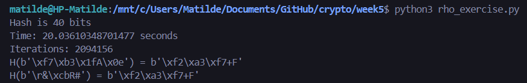

# Week #5 Extra

### Q1

Para determinar que construções hash *H'* também são **resistentes a colisões**, precisamos de analisar cada uma delas com base nas propriedades da função hash *H*. Assumimos que *H* é uma função hash **resistente a colisões** que produz saídas de 64 bits.

- **Resistente a Colisões**: É computacionalmente inviável encontrar dois inputs distintos *m* e *m'* tais que *H(m) = H(m')*.

1. **H' = H(m) || H(m) || H(m)**
   - Concatena *H(m)* três vezes, resultando numa saída de 192 bits.
   - Se *H(m) = H(m')*, então *H'(m) = H'(m')*. Como *H* é resistente a colisões, então *H'* também é resistente a colisões.

2. **H' = H(m || m || m)**
   - Faz hash da concatenação de *m* três vezes.
   - Uma colisão *H(m || m || m) = H(m' || m' || m')* implica  *m || m || m = m' || m' || m'*, levando a *m = m'*. Assim, é resistente a colisões como *H*.

3. **H' = H(64)**
   - Uma hash constante que retorna sempre *H(64)*.
   - Todos os inputs mapeiam para o mesmo valor de hash, tornando colisões triviais, logo não é resistente a colisões.

4. **H' = H(m || 64)**
   - Concatena *64* a *m* antes de fazer a hash.
   - Se *H* é resistente a colisões, então *H(m || 64)* também é resistente a colisões, porque encontrar *H(m || 64) = H(m' || 64)* implica *H(m) = H(m')*.

5. **H' = H(m)[0...10]**
   - Truncar a saída de 64 bits de *H(m)* para 11 bits.
   - Com apenas 11 bits, existem *211* possíveis saídas, tornando fácil encontrar colisões, logo não é resistente a colisões.

6. **H' = H(m[0...|m|-2])**
   - Faz hash de *m* após remover o último bit.
   - Dois inputs diferentes que diferem apenas no último bit podem gerar hash iguais, o que torna a procura de colisões muito mais fácil, logo não é resistente a colisões.

7. **H' = H(m) || H(m XOR 1|m|)**
   - Concatena *H(m)* com *H(m XOR 1|m|)*.
   - Encontrar uma colisão requer encontrar *m* e *m'* distintos tais que, tanto *H(m) = H(m')* quanto *H(m XOR 1|m|)* = *H(m' XOR 1|m'|)*, o que é tão difícil quanto partir *H*, logo é resistente a colisões.

8. **H' = H(m) if m = 064 && m = 164, H(m XOR 1|m|) otherwise**
   - É sempre necessário computar *H(m XOR 1|m|)*, pois *m* não pode ser, simultaneamente, 064 e 164.
   - Similar à alínea 7, depende da resistência a colisões de *H*, logo é resistente a colisões.

**Construções Resistentes a Colisões**: 1, 2, 4, 7, 8

**Construções Não Resistentes a Colisões**: 3, 5, 6

### Q2

#### Verificar a prova

Após detetar que h'i+1 = hi+1, o próximo passo é encontrar a colisão. 

A ideia principal é que, ao encontrar um ponto onde as duas sequências se encontram, podemos encontrar duas entradas distintas que levam a este ponto de encontro, resultando na mesma saída de hash.

- Identificar o índice *i* onde *h'i = hi*.

- A partir de *h'i*, encontrar dois pontos distintos que levaram a *hi*.

- Isto pode ser feito reiniciando a iteração a partir do início e do ponto de encontro, utilizando os mesmos passos de iteração (aplicação única e dupla de *H*).

- As entradas que levaram a *hi* através das duas sequências distintas serão as duas entradas que colidem, ou seja, *m* e *m'* tais que *H(m) = H(m')*.

A eficácia do método Rho baseia-se no **teorema do ciclo de Pigeonhole** , que afirma que numa função que mapeia *n* elementos em *n* elementos, com iterações suficientes, inevitavelmente ocorrerá uma repetição (ou ciclo).

- Como há um número finito de possíveis valores de hash *2^n* para uma função de hash de *n* bits, ao iterar repetidamente, inevitavelmente teremos um ciclo.

- O método Rho utiliza duas sequências de iteração: aplicação única de *H* e aplicação dupla de *H*.

- Devido ao princípio do ciclo, essas duas sequências inevitavelmente vão encontrar-se dentro de um ciclo.

- Uma vez detetado o ciclo, podemos encontrar duas entradas distintas que levam ao mesmo valor de hash, ou seja, uma colisão.

#### Implementação do código

O código implementado encontra-se no ficheiro **rho_exercise.py** e abaixo podemos observar uma execução.

- Número Total de Valores de Hash: *N = 28 x L*.
  
- Iterações Esperadas: É esperado encontrar uma colisão depois de realizar *$\sqrt{2^{8 \times L}}$* iterações. Se L aumentar, o número de iterações necessárias para encontrar uma colisão aumenta exponencialmente, tornando a hash maior e a criação de colisões mais difícil.
  
- Iterações Observadas: O número de iterações observadas está próximo da expectativa teórica (iterações esperadas). Variações são normais devido à natureza probabilística do algoritmo.

   - Aproximadamente 2.094.156 iterações para *L=5*.
  
- Tempo Gasto: Aproximadamente 20,04 segundos. O tempo gasto é proporcional ao número de iterações realizadas, logo se existir um aumento do L, o número de ietrações aumenta e, consequentemente, o tempo gasto também.
  
  - Iterações por Segundo para *L=5*: *2.094.156 iterações / 20,04 segundos* = *104.500 iterações/segundo*.

### Q3

#### 1

A função *gen* gera um *estado inicial* *x* que é um número aleatório entre 0 e 1008, pois o LSFR só tem 1009 estados diferentes possíveis. Esse *x* vai ser usado para gerar a chave usada para encriptar as mensagens. Assim, no máximo, são geradas 1009 chaves diferentes.

Se o atacante mandar para o oráculo de encriptação uma mensagem qualquer, o atacante vai receber essa mesma mensagem encriptada. A encriptação é a operação XOR entre os bits da mensagem e da chave.

Assim, se o atacante mandar 1009 mensagens, vai conseguir 1009 chaves diferentes, permitindo-lhe desencriptar/conhecer a mensagem enviada na experiência, pois **Key = mensagem XOR mensagem encriptada**.

#### 2

Para o ataque ser bem sucessido, é necessário fazer os seguintes passos:

- Pedir a mensagem encriptada de 1009 mensagens diferentes e obter 1009 chaves, fazendo a operação **Key = mensagem XOR mensagem encriptada**.

- Enviar duas mensagem de 32 bytes *m0* e *m1* ao oráculo para encriptar e receber uma delas encriptada *cb*.

- Adivinhar b, fazendo a operação *cb XOR Key* com as chaves obtidas anteriormente. Se o resultado for igual a *mb*, então adivinha-se corretamente o bit b.

Com base nestas operações, o atacante pode determinar corretamente que mensagem foi encriptada, aumentando a probabilidade de acertar para 100% em vez de apenas 50% (acertar aleatoriamente).