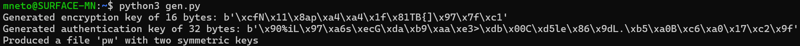
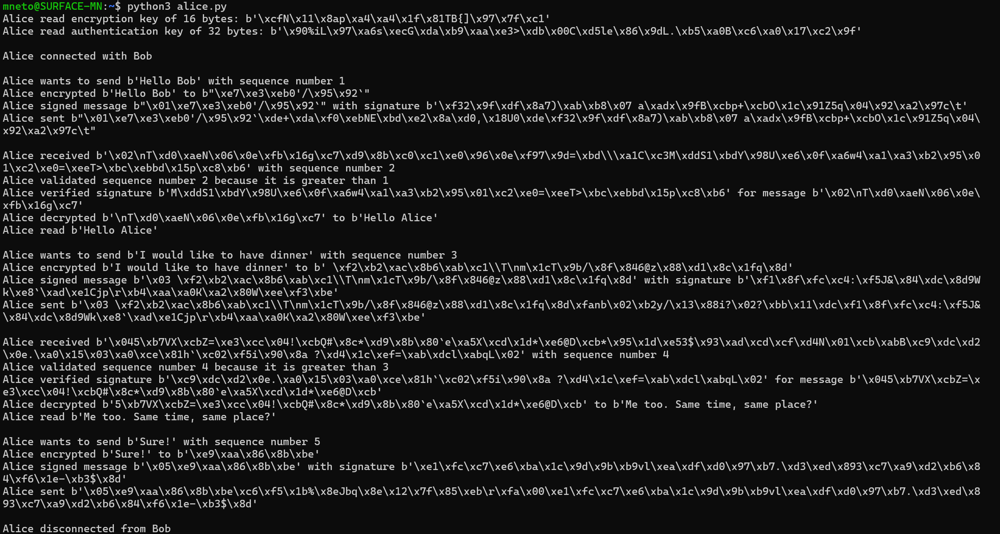
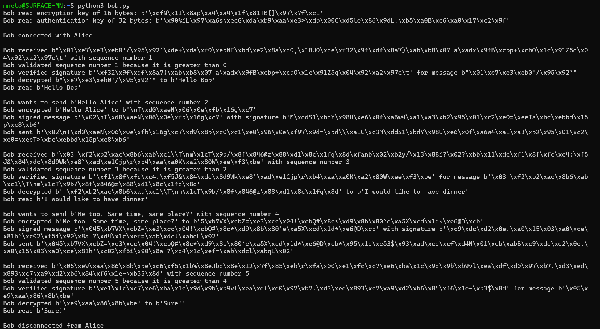

# Week #8 Extra

## Q1: *Implementing Authenticated Encryption*

O ficheiro `gen.py` produz um ficheiro `pw` com duas chaves simétricas: uma para encriptação (16 *bytes*) e outra para autenticação (32 *bytes*).

O ficheiro `common.py` contém as funções necessárias para a comunicação entre a Alice e o Bob, nomeadamente:
- `check_sequence_number(agent, received, sent)` para o agente `agent` validar o número de sequência recebido `received`, comparando-o com o último número de sequência enviado `sent`;
- `encrypt(agent, key, plaintext, nonce)` para o agente `agent` cifrar o texto `plaintext` com a chave `key` e *nonce* `nonce`, usando **AES-128-CTR**;
- `decrypt(agent, key, ciphertext, nonce)` para o agente `agent` decifrar o criptograma `ciphertext` com a chave `key` e *nonce* `nonce`, usando **AES-128-CTR**;
- `read_keys(agent)` para o agente `agent` obter as chaves a partir da leitura do ficheiro `pw`;
- `receive(agent, connection, keys, last_sequence_number_sent = 0)` para o agente `agent` receber uma mensagem através da conexão `connection`, decifrando-a e verificando-a com as chaves `keys`, bem como confirmando o número de sequência, comparando-o com o último número de sequência enviado `last_sequence_number_sent`;
- `send(agent, connection, keys, plaintext, sequence_number)` para o agente `agent` enviar o texto `plaintext` através da conexão `connection`, cifrando-o e assinando-o com as chaves `keys`, bem como adicionando-lhe o número de sequência `sequence_number`;
- `sign(agent, key, message)` para o agent `agent` assinar a mensagem `message` com a chave `key`, usando **HMAC-SHA256**;
- `verify(agent, key, message, signature)` para o agente `agent` verificar a assinatura `signature` da mensagem `message` com a chave `key`, usando **HMAC-SHA256**.

O ficheiro `alice.py` obtém as chaves a partir da leitura do ficheiro `pw`, envia as mensagens "*Hello Bob*", "*I would like to have dinner*" e "*Sure!*" usando **AES-128-CTR** para garantir confidencialidade, **HMAC-SHA256** para garantir autenticidade e com números de sequência para proteger contra ataques de repetição, recebendo as respetivas respostas e processando-as adequadamente.

O ficheiro `bob.py` obtém as chaves a partir da leitura do ficheiro `pw`, envia as mensagens "*Hello Alice*" e "*Me too. Same time, same place?*" usando **AES-128-CTR** para garantir confidencialidade, **HMAC-SHA256** para garantir autenticidade e com números de sequência para proteger contra ataques de repetição, recebendo as respetivas respostas e processando-as adequadamente.

Toda a comunicação é validada e não existem erros.

## Q2: *Signing with RSA*

Sejam:
- $d$ - chave privada
- $e$ - chave pública
- $M$ - mensagem a assinar
- $\sigma$ - assinatura

### P1

Considere-se que assinar uma mensagem é encriptá-la usando a chave privada, isto é:

- **Assinar:** $\sigma \leftarrow M^d \mod N$
- **Verificar:** computar $M' \leftarrow \sigma^e \mod N$ e aceitar se $M = M'$

Este esquema de assinatura está sujeito a forjas, dado que é possível construir uma assinatura válida para uma mensagem sem conhecimento da chave privada $d$.

Por exemplo, as mensagens $M = 0$, $M = 1$ ou $M = N - 1$ são trivialmente forjáveis, dado que a assinatura é igual à própria mensagem, isto é:
- $M = 0$: $\sigma \leftarrow M^d \mod N = 0^d \mod N = 0$
- $M = 1$: $\sigma \leftarrow M^d \mod N = 1^d \mod N = 1$
- $M = N - 1$: $\sigma \leftarrow  M^d \mod N = (N - 1)^d \mod N = N - 1$

Como tal, é possível construir uma assinatura válida para qualquer uma das mensagens $M = 0$, $M = 1$ ou $M = N - 1$ sem conhecimento da chave privada $d$, pelo que este esquema de assinaturas está sujeito a forjas.

Para além disto, se for possível encontrar uma mensagem $R$ tal que $R^eM \mod n$ é uma outra mensagem cuja assinatura $S = (R^eM)^d \mod n$ é conhecida, então, como $S \equiv (R^eM)^d \equiv R^{ed}M^d \equiv RM^d \pmod{n}$, é possível computar $S/R = RM^d/R = M^d$, ou seja, é possível computar a assinatura da mensagem $M$, $\sigma \leftarrow M^d$, sem conhecer a chave privada $d$.

### P2

Considere-se uma construção *Full Domain Hash*, isto é:

- **Assinar:** computar $h \leftarrow H(M)$ e $\sigma \leftarrow h^d \mod N$
- **Verificar:** computar $h' \leftarrow \sigma^e \mod N$ e aceitar se $H(M) = h'$

Para garantir que o ataque anterior não resulta, esta construção aproveita as propriedades de **resistência a pré-imagens** e **resistência a colisões** das funções de *hash*. 

A **resistência a pré-imagens** impossibilita que um atacante consiga descobrir qual a mensagem a que corresponde uma determinada *hash*. 
Isto impede:
- O primeiro ataque descrito anteriormente, ao impossibilitar que um atacante descubra uma mensagem cuja *hash* seja $0$, $1$ ou $N - 1$, em que a assinatura da mensagem seria igual à *hash* da mensagem. 
- O segundo ataque descrito anteriormente, porque, mesmo que o atacante encontre uma *hash* $h$ tal que $h^eg \mod n$ seja outra *hash* cuja assinatura $S \equiv (h^eg)^d \equiv hg^d \pmod{n}$ seja conhecida, pelo que $S/h = hg^d / h = g^d$, o atacante não saberá a que mensagem corresponde a *hash* $g$, pelo que a assinatura $g^d$ torna-se inútil, por ser desconhecida a mensagem correspondente.

A **resistência a colisões** impossibilita que um atacante consiga descobrir duas mensagens com a mesma *hash* e, consequentemente, com a mesma assinatura, impedindo forjas triviais.

Para além disto, a **imprevisibilidade** das funções de *hash* também impede os ataques descritos anteriormente, ao impossibilitar a extração de alguma informação útil ao alterar a mensagem a forjar, por não existir nenhuma relação algébrica entre a *hash* $h \leftarrow H(M)$ e a mensagem correspondente $M$.
