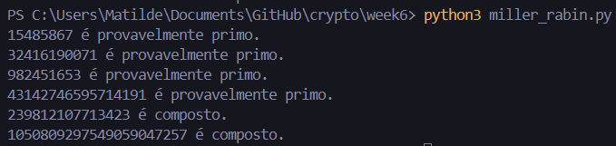

# Tutorial #6

## 1 

- $C = 20$
- $e = 13$
- $n = 77$

**Qual é a mensagem original $M$?**

Se $n = p \times q = 77$, então $p = 7$ e $q = 11$.

$\phi(n) = (p - 1)(q - 1) = (7 - 1)(11 - 1) = 6 \times 10 = 60$

$$d \equiv e^{-1} \pmod{\phi(n)}$$
$$e \times d \equiv 1 \pmod{\phi(n)}$$
$$13 \times d \equiv 1 \pmod{60}$$
$$d \equiv 37 \pmod{60}$$

$M = C^d \mod n = 20^{37} \mod 77 = 48$

## 2

- $e = 65$
- $n = 2881$

**Qual é a chave privada $d$?**

Se $n = p \times q = 2881$, então $p = 43$ e $q = 67$.

$\phi(n) = (p - 1)(q - 1) = (43 - 1)(67 - 1) = 42 \times 66 = 2772$

$$d \equiv e^{-1} \pmod{\phi(n)}$$
$$e \times d \equiv 1 \pmod{\phi(n)}$$
$$65 \times d \equiv 1 \pmod{2772}$$
$$d \equiv 725 \pmod{2772}$$

$d = 725$

## 3

Não, não é seguro gerar apenas uma nova chave pública $e$ e uma nova chave privada $d$, mantendo o mesmo módulo $n$.
Se a chave privada original $d$ for comprometida, então o atacante, que conhece os valores antigos $e$ e $d$, pode calcular $\phi(n)$, pois $e \times d \equiv 1 \pmod{\phi(n)}$.
Tendo $\phi(n)$ e $n$, é mais provável que o atacante consiga fatorizar $n$ para encontrar os primos $p$ e $q$.

Uma vez que o atacante tem $p$ e $q$, pode calcular $\phi(n)$ novamente e derivar qualquer novo par de chaves $e'$ e $d'$.
Portanto, para restabelecer a segurança, o Bob deve gerar um novo módulo $n$ com novos primos $p$ e $q$ e novas chaves $e$ e $d$.

## 4

Não, não é seguro que a Alice envie uma mensagem cifrada contendo apenas o número de telemóvel dela utilizando RSA, mesmo com um módulo $n$ muito grande e seguro contra fatorização.
O problema está no facto de que o número de telemóvel é um valor relativamente pequeno e previsível, o que torna o espaço de mensagens possíveis bastante limitado.

Um atacante pode explorar essa limitação realizando um ataque de força bruta ou um ataque de dicionário.
Pode, assim, gerar uma lista de todos os possíveis números de telemóvel válidos (o que é viável, dado que os números de telemóvel seguem formatos específicos e têm um comprimento limitado), cifrar cada um usando a chave pública do Bob e comparar o resultado com a mensagem.
Quando encontrar uma correspondência, o atacante irá descobrir o número de telemóvel da Alice.

## 5

O algoritmo de **Miller-Rabin** é poderoso para verificar se números grandes são primos de forma eficiente e com alta confiança.
Embora seja probabilístico, a chance de um número composto ser identificado como primo pode tornar-se negligenciável ao aumentar o número de iterações. 

O código está implementado no ficheiro `miller_rabin.py` e abaixo encontra-se um exemplo de execução.

